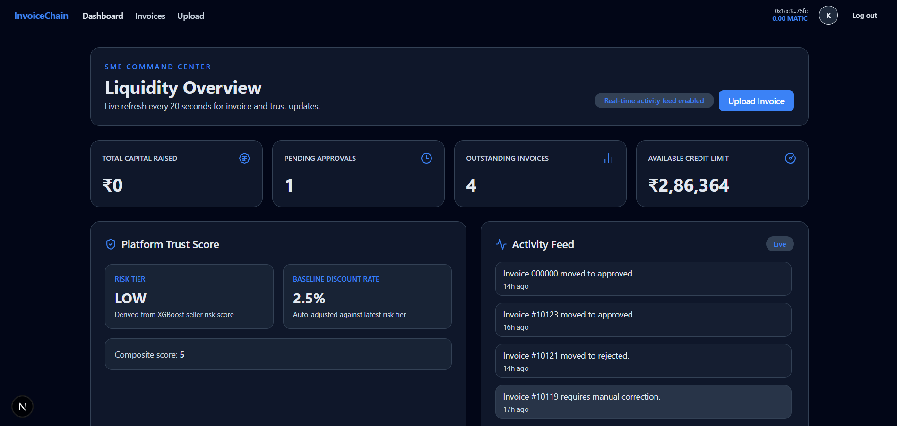
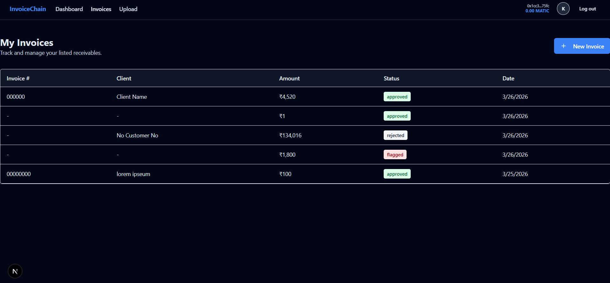
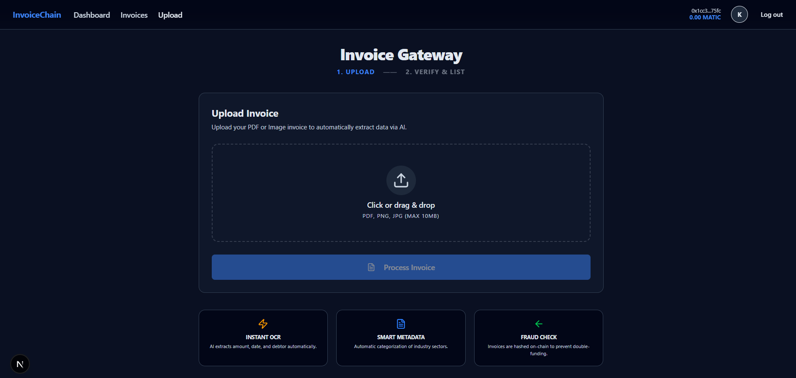
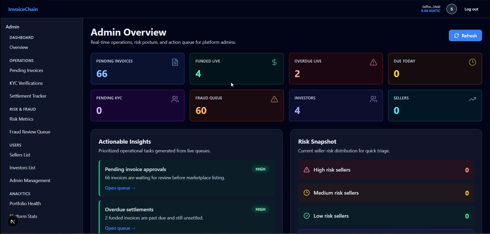
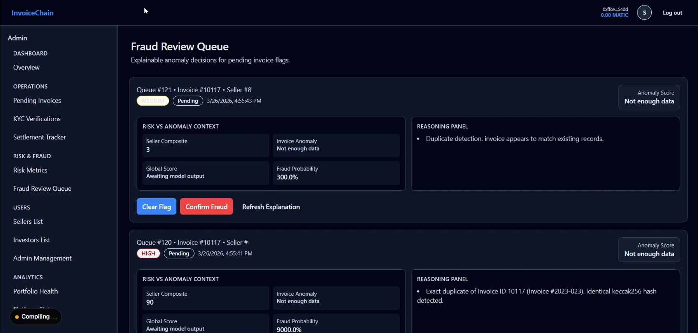

# InvoiceChain - A Decentralized Marketplace for Fractionalized SME Receivables

## Table of Contents

- [Project Summary](#project-summary)
- [Problem Statement and Existing Challenges](#problem-statement-and-existing-challenges)
- [How InvoiceChain Does It](#how-invoicechain-does-it)
- [Folder Structure](#folder-structure)
- [Technology Stack](#technology-stack)
- [Prerequisites](#prerequisites)
- [Installation](#installation)
- [Configuration](#configuration)
- [Running the Application](#running-the-application)
- [UI Previews](#ui-previews)
- [Demo Video](#demo-video)

## Project summary

InvoiceChain is a decentralized marketplace that enables Small and Medium Enterprises (SMEs) to tokenize their outstanding invoices as ERC-1155 multi-token assets on blockchain, providing immediate liquidity while offering investors fractional ownership opportunities in revenue-generating receivables.

Traditional invoice factoring is slow and dominated by large financial intermediaries who charge high fees. InvoiceChain puts the entire workflow on-chain : from invoice minting to trading, settlement, and escrow - making the process transparent, automated, and accessible to any business regardless of size.

## Problem statement and existing challenges

Invoice factoring - the practice of selling outstanding invoices at a discount in exchange for immediate cash has a huge market. Yet the process remains fundamentally broken for the businesses that need it most: small and medium enterprises.
The traditional invoice factoring process involves a financial intermediary (a 'factor') who purchases the invoice from the SME at a discount, advances cash immediately, and then collects the full amount from the buyer when it is due. On paper, this sounds ideal. In practice, it has a number of inefficiencies:

- SMEs apply to banks or factoring companies. This requires credit history, financial statements and audited accounts.
- Banks reject 50-55% of SME loan/factoring applications globally.
- In India, a very small percentage of MSMEs have access to formal credit.
- Even when SMEs do qualify, the cost is huge:
  - Factor fees: 1.5% to 5%
  - Processing fees, due diligence fees, legal fees can add another 1–3%.
  - For a razor-thin margin business, this can eliminate the entire profit from a transaction.
- Buyer pays the factor directly. This process is not transparent, SME has no visibility into collection status.
- Invoice fraud is a massive and growing problem in the factoring industry:
- Duplicate invoice fraud: the same invoice submitted to multiple lenders or factors simultaneously.
- Ghost invoice fraud: entirely fabricated invoices with no underlying transaction.
- A typical invoice factoring transaction involves:
  - Physical or scanned document submission
  - Manual data entry and verification by the factor's team
  - Legal review of invoice validity
  - Bank wire transfers
  - Manual reconciliation at settlement

  This entire process can take 7-21 days, defeating the purpose of 'fast liquidity'.

<p align="center">
  
</p>

## How InvoiceChain does it

- Permissionless Access via Wallet Authentication - Instead of credit applications, financial statements, and eligibility checks:
  - Any user registers with an email and connects a MetaMask wallet.
  - KYC is handled via document upload and admin verification, a one-time process.
  - Once KYC-verified, an SME can upload and tokenize any invoice immediately.
- AI-Powered OCR Pipeline (Eliminating Manual Processing)
  - SME uploads a PDF or photo of the invoice.
  - PyMuPDF + OpenCV preprocesses: deskews, denoises, binarizes the image.
  - Tesseract OCR extracts: invoice number, client name, amount, due date.
  - Confidence scoring flags low-quality extractions for manual correction.
  - Total processing time: under 2 minutes vs. 7-21 days in traditional factoring.
- On-Chain Fraud Prevention (keccak256 Hash Registry)
  - After OCR, fields are canonicalized (normalized, lowercased, deduplicated).
  - A keccak256 hash of the canonical string is generated - a unique fingerprint of the invoice.
  - Before minting, the smart contract checks: has this hash ever been registered?
  - If yes: transaction reverts with 'Duplicate invoice'.
  - If no: hash recorded on-chain permanently - no future system can accept this invoice again.
- Transparent Marketplace with Risk Scoring
  - All listings are public on the marketplace - any investor can browse, filter, and analyze.
  - Each invoice has a multi-factor risk score (0–100) computed from: payment history, client reputation, seller track record, invoice age, industry risk.
  - Machine learning anomaly detection flags unusual patterns before they reach the marketplace.
  - Investors see the full ownership history on-chain, no information asymmetry.
- Smart Contract Escrow (Eliminating Counterparty Risk)
  - When an investor purchases an invoice, funds go into a smart contract escrow - not to a company.
  - The smart contract releases funds to the SME only when ownership transfer is confirmed.
- Auction & Fractional Ownership (Democratizing Investment)
  - Auction mechanism: price discovery through competitive bidding — no more take-it-or-leave-it factor rates.
  - Fractional shares: an invoice can be split into shares - retail accessible.

<p align="center">
  
</p>

## Folder Structure

```bash
Invoice-Chain/
├── backend/                    # FastAPI backend (Python)
│   ├── app/                   # Core application code
│   │   ├── api/               # API config & routing setup
│   │   ├── auth/              # JWT authentication & security
│   │   ├── ml/                # ML models (fraud detection, risk scoring)
│   │   ├── routers/           # API endpoints (invoice, KYC, wallet)
│   │   ├── schemas/           # Pydantic schemas (data validation)
│   │   └── services/          # Business logic (blockchain, OCR, scoring)
│   ├── data/                  # CSV datasets for ML training
│   ├── scripts/               # DB seeding & ML training scripts
│   └── tests/                 # Backend tests
│
├── blockchain/                # Smart Contracts (Hardhat + Solidity)
│   ├── contracts/             # Solidity contracts (Auction, NFT, Marketplace)
│   ├── deployments/           # Deployment addresses & ABIs
│   ├── ignition/              # Hardhat deployment modules
│   ├── scripts/               # Deployment scripts
│   └── test/                  # Smart contract tests
│
├── frontend/                  # Next.js frontend
│   ├── app/                   # App routes (Admin, SME, Investor, Auth)
│   ├── components/            # Reusable UI components
│   ├── context/               # Global state (Auth, Wallet)
│   ├── hooks/                 # Custom React hooks
│   └── lib/                   # Utilities, API clients, Web3 helpers
│
├── docker-compose.yml         # Docker orchestration
├── package.json               # Root workspace config
└── README.md                  # Project documentation
```

## Technology Stack

### Frontend

- Framework: Next.js (App Router)
- Library: React
- Language: TypeScript
- Styling: Tailwind CSS

### Backend

- Framework: FastAPI (Python)
- Database: PostgreSQL (Neon Serverless)
- Authentication: JWT (JSON Web Tokens)

### AI & Machine Learning

- Anomaly Detection: Scikit-Learn (Isolation Forest)
- Risk Scoring: XGBoost
- Document Processing: Tesseract OCR (Optical Character Recognition)

### Blockchain & Web3

- Smart Contracts: Solidity
- Development Environment: Hardhat
- Client Library: Ethers.js / Viem
- Network: Base Sepolia (Testnet)
- Token Standard: ERC-1155 (Invoice NFTs)

Git-based feature branch workflow was followed throughout the development lifecycle, with each member working on dedicated feature branches and merging via pull requests to the main branch. GitHub served as the central collaboration hub - GitHub Issues were used to track tasks and bugs, GitHub Project Boards were used for planning and progress tracking.

## Prerequisites

Install the following before setup:

- **Node.js** 22+ and npm
- **Python** 3.11+ (3.13 is also supported for most packages)
- **Docker Desktop** (for Redis/MinIO)
- **PostgreSQL** 15+ (cloud DB - Neon recommended; see `backend/.env.example` for the sample `DATABASE_URL`)
- **MetaMask** (for wallet-based features)
- **Tesseract**

---

## Installation

### Front-End Setup

```bash
npm install
cd frontend && npm install
cd ..
```

### Blockchain Setup

```bash
cd blockchain
npm install
cd ..
```

### Back-End Setup

```bash
cd backend
python -m venv .venv
# Windows (Git Bash)
source .venv/Scripts/activate
# Windows (PowerShell)
# .\.venv\Scripts\Activate.ps1
pip install -r requirements.txt
cd ..
```

---

## Configuration

### 1. Environment Variables

Copy the example files, then update the values for your environment:

- `backend/.env.example` -> `backend/.env`
- `blockchain/deployments/.env.example` -> `blockchain/.env`

#### backend/.env (**create this file**)

Refer to `backend/.env.example`.

#### blockchain/.env (**create this file**)

Refer to `blockchain/deployments/.env.example`.

---

## Running the Application

### 1. Start Infrastructure (Redis + MinIO)

From repository root:

```bash
docker compose up -d redis minio
```

This starts:

- Redis on `localhost:6379`
- MinIO API on `localhost:9000`
- MinIO Console on `localhost:9001`

Default MinIO credentials (from compose):

- User: `invoicechain`
- Password: `invoicechain123`

**PostgreSQL:**
We used a cloud Postgres URL via `DATABASE_URL` (Neon).

### 2. Blockchain Setup

#### Compile and test contracts

From `blockchain/`:

```bash
npx hardhat compile
npx hardhat test
```

#### Deploy to Base Sepolia

```bash
npx hardhat run scripts/deploy.ts --network baseSepolia
```

Deployment artifacts are written to:

- `blockchain/deployments/baseSepolia.json`
- `blockchain/deployments/addresses.ts`

Use deployed values to populate backend env fields, especially:

- `INVOICE_NFT_CONTRACT_ADDRESS`
- `MINTER_PRIVATE_KEY`

### 3. Run the Backend

From `backend/`:

```bash
uvicorn main:app --reload --host 0.0.0.0 --port 8000
```

### 4. Run the Frontend

From `frontend/`:

```bash
npm run dev
```

## UI Previews

### SME

#### Seller Dashboard

<p align="center">
  
</p>

#### Current Invoices Status Page

<p align="center">
  
</p>

#### Invoice Upload Gateway

<p align="center">
  
</p>

### Investor

### Admin

#### Admin Dashboard

<p align="center">
  
</p>

#### Fraud Review Queue

<p align="center">
  
</p>

#### Platform Statistics and Analytics

<p align="center">
  
</p>
<p align="center">
  
</p>

## Demo Video
